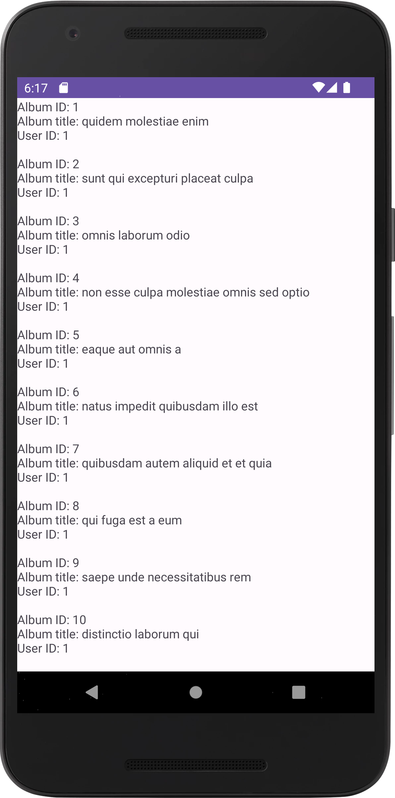

# retrofit-demo-music-albums

Uma listagem com todos os álbuns musicais em nuvem.

Autor: Guilherme Reis - [LinkedIn](https://www.linkedin.com/in/guilhermereisdev/)

### Recursos do app

- Exibe uma lista com álbuns musicais contendo nome, id do álbum e id do usuário dono do álbum.

### Técnicas utilizadas

- Conexão à [API {JSON} Placeholder](https://jsonplaceholder.typicode.com/) para acesso aos dados dos álbuns.
- Retrofit2 como biblioteca de HTTP Client.
- Coroutines para execução assíncrona.
- Okhttp3 Logging Interceptor para exibir o conteúdo trafegado pela API nos logs da IDE.
- ViewModel
- LiveData

### Telas

_Clique na imagem para ver em tela cheia_

